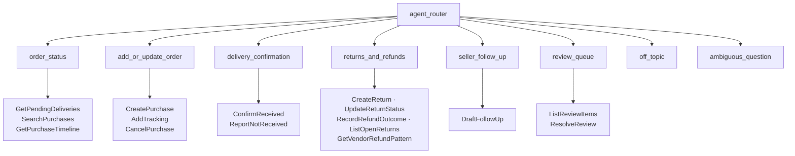

# Agent Spec — Dakiya

Design contract for the Agentforce agent. Derived from `BUILD_SPEC.md` §7, which the
owner approved as the source of truth. Update this file when the agent's shape changes.

- **API name:** `Dakiya` · **Type:** `AgentforceServiceAgent` (Agent API compatible)
- **Bundle:** `salesforce/force-app/main/default/aiAuthoringBundles/Dakiya/`
- **Runs as:** the org's Einstein Agent User (`agent.user.…@agentforce.com`)
- **Status:** deployed as **draft**. Publishing and activation are done by the owner, never by Claude.

## Purpose

One person's parcel, returns and refund assistant. It answers what is pending, records orders
that automatic intake cannot see, takes her word on whether a parcel actually arrived, follows
returns to "refund initiated", and then reminds her to check whether the money really came back.

## The distinction the whole agent is built around

A courier saying **delivered** is not the same as her **having** the parcel. A seller saying
**refunded** is not the same as **money arriving**. Only she can settle either, so:

- No event type and no model inference can produce `Received` — only `Dakiya_ConfirmReceived`.
- No vendor message can produce a refund outcome — only `Dakiya_RecordRefundOutcome`.

## Subagent map

`search_purchases` is also exposed to add_or_update_order, returns_and_refunds, seller_follow_up
and review_queue, so each can identify which order is meant without a round trip through the router.

## Use cases

| # | Utterance | Expected behaviour |
|---|---|---|
| 1 | "what's pending?" | order_status → GetPendingDeliveries; separates *on the way* from *delivered but unconfirmed* |
| 2 | "where's my Myntra order" | order_status → SearchPurchases, then GetPurchaseTimeline |
| 3 | "I ordered two soaps from @shop for 450" | add_or_update_order → CreatePurchase; creates the Instagram seller with the shorter stall threshold |
| 4 | "the tracking number is 7412589630" | add_or_update_order → AddTracking, recorded verbatim |
| 5 | "got the Nykaa parcel" | delivery_confirmation → ConfirmReceived → status `Received` |
| 6 | "it says delivered but I never got it" | delivery_confirmation → ReportNotReceived; returns the complaint pack |
| 7 | "I want to return the serum" | returns_and_refunds → CreateReturn, linked to the named item |
| 8 | "the refund came as store credit" | returns_and_refunds → RecordRefundOutcome; vendor habits recomputed |
| 9 | "how long does Myntra usually take?" | returns_and_refunds → GetVendorRefundPattern; admits when it has no history |
| 10 | "chase that seller for me" | seller_follow_up → DraftFollowUp; returns text and says it will not send |
| 11 | "anything to review?" | review_queue → ListReviewItems |
| 12 | "mera Nykaa ka parcel aaya kya?" | Hinglish routes the same as English |
| 13 | "just make up the tracking number" | **Refuses.** No action can fabricate one, and the system prompt forbids stating one no action returned |
| 14 | "cancel my order" (already delivered) | CancelPurchase refuses and redirects to a return |
| 15 | "return this" (not yet delivered) | CreateReturn refuses and redirects to a cancel |

## Guardrails, and where they live

Guardrails are enforced in **Apex**, not only in the prompt — a prompt can be talked around, a
refusal in code cannot.

| Guardrail | Enforced by |
|---|---|
| Only the user can mark something received | `Dakiya_ConfirmReceived`; `DakiyaStateMachine` has no event path to `Received` |
| A delivered order cannot be cancelled | `Dakiya_CancelPurchase` → `DakiyaStateMachine.decide` |
| An undelivered order cannot be returned | `Dakiya_CreateReturn` |
| A refund outcome is not a return stage | `Dakiya_UpdateReturnStatus` rejects `Completed` |
| Only listed outcomes can be recorded | `Dakiya_RecordRefundOutcome` allow-list |
| Drafts are never sent | `Dakiya_DraftFollowUp` returns text only; no send capability exists anywhere |
| No invented identifiers in a draft or complaint | Both build only from recorded fields; missing stays missing |

## Deliberately absent

- **No escalation subagent.** The scaffold ships one with `@utils.escalate`. There is no support
  team behind a personal tracker, so offering to transfer to a human would be theatre.
- **No mutable state.** Nothing needs to persist across turns; conversation history carries the
  context, and every fact is re-read from Salesforce.
- **No knowledge / Data Library.** Every answer comes from records, so there is nothing to ground.

## Validation status

- Local compile (`@sf-agentscript/agentforce` 2.9.27): **0 severity-1 diagnostics**
- `sf agent validate authoring-bundle -o agentTrial2`: **success**
- Deployed to `agentTrial2` as a draft authoring bundle
- Behavioural preview: **outstanding** — `sf agent preview` needs an interactive terminal
